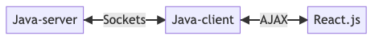

# Yatzy
This is an online Yatzy. It is an extension of my original Yatzy written at my first year at uni. 

# Code structure
Using MVC-architecture. P2P connection between players...

## Model/Server
Java is used for backend (as the server). 

### Player-class (Client)
A Player-class is created whenever a game is created... 

## View
CLI is written either in Java or Python.
GUI in React.js (Node.js could be used for CLI as intermediary...)

## Controller
Java...

# About this project
This project has the following objectives:

* To learn about P2P-programming/Server and Sockets/backend-programming in Java.
* To connect different systems (React.js/Java/Python) over network. 
* To improve (Python-)code from 1st year project (P-uppgift).
* To have fun!

## TODO
* Plan project (how many hours...), maybe even Gantt...
	* Architecture, parts, etc.
