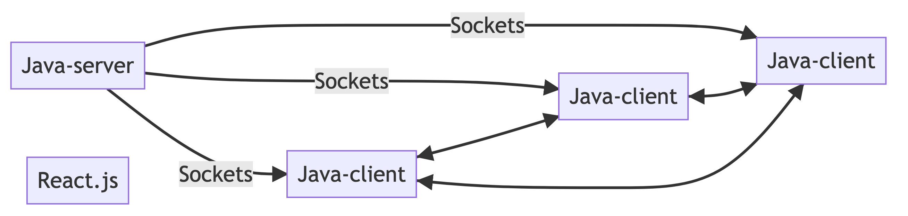

# YATZY
This is an online Yatzy. It is an extension of my original Yatzy written at my first year at uni. 

## Structure
Using MVC-architechture. 

### Model
Java is used for backend...

### View
CLI is written either in Java or Python.
GUI in React.js (Node.js could be used for CLI as intermediary...)

### Controller
Java...
